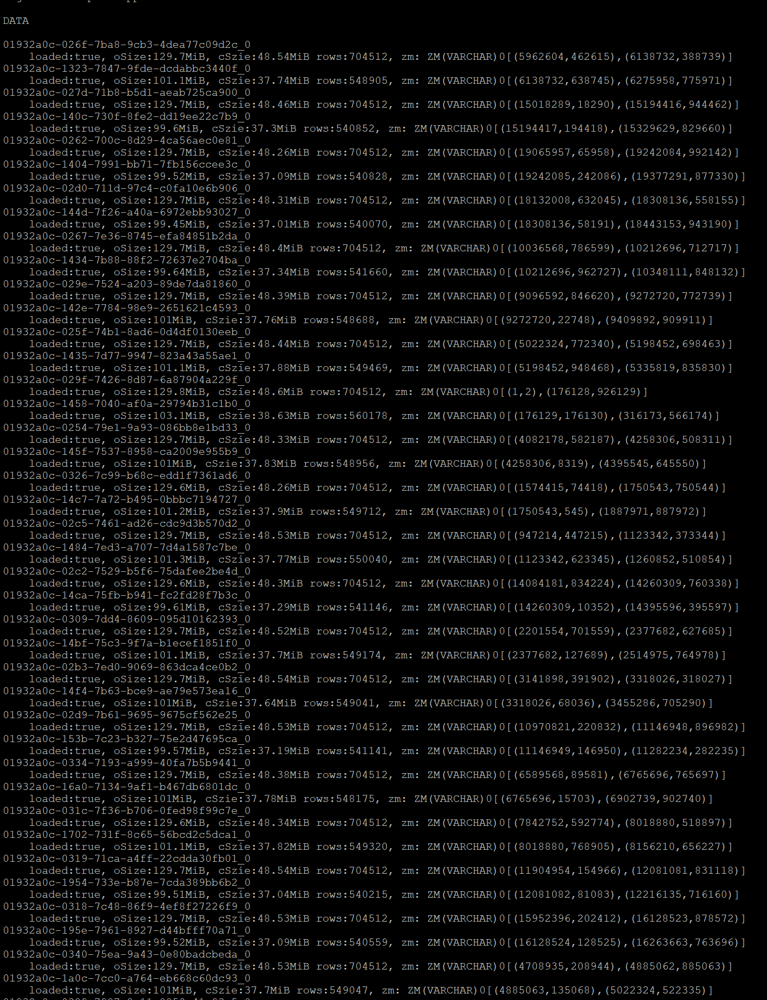

# 合并调度

## 调度器

调度器遍历所有的对象。这些对象会按序被每个策略检查。如果一个对象满足了一个策略，那么它会被后续策略跳过。每一次merge产生的对象同
属于一个segment。

## Policies

### Basic Policy

基础策略是用来将小的对象合并成大的对象的。如果一个对象小于110MB，那么它会被加入这个策略中，并在后续执行过程中合并成不小于128MB。
但是，一个表一次只能合并16个或总大小小于256MB的object。

### Compact Policy

此策略不会考虑小于110MB的对象。压缩策略会应用把tombstone应用到对象上。此策略会记录大小大于110MB的tombstone或存在时间大于10分钟
且大小大于10MB的tombstone。然后，此策略会检查哪些对象中的数据在这些tombstone中，并将这些对象做合并，以减少tombstone和object的大小。

### Overlap Policy

此策略不会考虑小于110MB的对象。Overlap策略首先按照segment中对象数量将所有对象分组。然后在每组内部检查对象的zonemap是否有重叠。
如果有重叠，则将这些object合并成新的segment。

### Tombstone Policy

tombstone策略会尽力将多个tombstone合并成一个tombstone

## 内存检查

大量对象的合并会消耗大量内存。如果不对单次合并的数据量加以限制，TN很可能会OOM。对于内存消耗量的估计，我们基于合并的总行数作判断。
目前的预估量是一行占用30B内存。目前对merge总消耗内存的限制控制在当前可用内存的2/3。如果某次merge占用的内存大于当前可用内存的2/3，
则不进行这次merge。

## 写放大问题

旧object中已被删除的数据不会被保留到新的object中，但是merge完成后并不会立刻删除旧的object。因此每次merge最差情况会造成磁盘占用翻倍
（旧object中没有数据被删除），最好情况是不会增加磁盘占用（旧的object中所有数据都已被删除）。

### 示例

新建t1表并insert：
```mysql
MySQL [test]> desc t1;
+-------+----------------+------+------+---------+-------+---------+
| Field | Type           | Null | Key  | Default | Extra | Comment |
+-------+----------------+------+------+---------+-------+---------+
| a     | INT(32)        | NO   | PRI  | NULL    |       |         |
| b     | INT(32)        | YES  | MUL  | NULL    |       |         |
| c     | VARCHAR(65535) | YES  |      | NULL    |       |         |
+-------+----------------+------+------+---------+-------+---------+
3 rows in set (0.002 sec)

MySQL [test]> insert into t1 select *,*, "ccccccccccccccccccccccccccccccccc" from generate_series(1, 100000000)g;
```

t1 表大小为：
```mysql
MySQL [test]> select mo_ctl('dn', 'inspect', 'object -t test.t1')\G
*************************** 1. row ***************************
mo_ctl(dn, inspect, object -t test.t1):
msg: 272514-t1 verbose 0

DATA
summary: 49 total, 0 unknown, avgRow 2040816, avgOsize 129.3MiB, avgCsize 32.15MiB

TOMBSTONES
summary: 0 total, 0 unknown, avgRow 0, avgOsize 0B, avgCsize 0B

minOsizeObj:110MiB, maxOneRun:16, maxOsizeMergedObj: 128MiB, offloadToCNSize:78.12GiB, hints: []
1 row in set (0.001 sec)
```
49*129.3 ~= 6.18GiB

索引表表大小为：
```mysql
MySQL [test]> select mo_ctl('dn', 'inspect', 'object -t test.__mo_index_secondary_01934330-5bbb-7f1e-991c-3f7db0f4116f')\G
*************************** 1. row ***************************
mo_ctl(dn, inspect, object -t test.__mo_index_secondary_01934330-5bbb-7f1e-991c-3f7db0f4116f):
msg: 272515-__mo_index_secondary_01934330-5bbb-7f1e-991c-3f7db0f4116f verbose 0

DATA
summary: 21 total, 0 unknown, avgRow 4761904, avgOsize 133.5MiB, avgCsize 74.93MiB

TOMBSTONES
summary: 0 total, 0 unknown, avgRow 0, avgOsize 0B, avgCsize 0B

minOsizeObj:110MiB, maxOneRun:16, maxOsizeMergedObj: 128MiB, offloadToCNSize:78.12GiB, hints: []
1 row in set (0.001 sec)
```
21*133.5~=2.74GiB

Merge总量统计：
```
272515-__mo_index_secondary_01934330-5bbb-7f1e-991c-3f7db0f4116f: 21 times, 11.46GiB
272514-t1: 44 times, 29.02GiB
```
对应到具体文件占用：
```bash
ziran@localhost:~/matrixone/mo-data/shared$ du -h
52K     ./gc
80K     ./ckp
17G     .
```
考虑到`lz4`的压缩比为2.101(https://github.com/lz4/lz4)，此结果应该符合预期。

## TPCH测试过程中遇到的问题


这是tpch的lineitem load之后的object分布。可以发现这些object是已经排好序了，但是有部分object大小小于110MB，因此会由Basic Policy
进行merge，这些object完成merge之后，新的object会和其他object的zonemap发生重叠，因此会造成大量overlap策略触发的merge。
关键日志：https://grafana.ci.matrixorigin.cn/explore?panes=%7B%22Zij%22:%7B%22datasource%22:%22loki%22,%22queries%22:%5B%7B%22refId%22:%22A%22,%22expr%22:%22%7Bnamespace%3D%5C%22mo-search-nightly-a0504bdc1-20241115%5C%22%7D%20%7C~%20%60MERGE.%2A272536-lineitem%60%22,%22queryType%22:%22range%22,%22datasource%22:%7B%22type%22:%22loki%22,%22uid%22:%22loki%22%7D,%22editorMode%22:%22builder%22%7D%5D,%22range%22:%7B%22from%22:%221731650478960%22,%22to%22:%221731673540215%22%7D%7D%7D&schemaVersion=1&orgId=1
